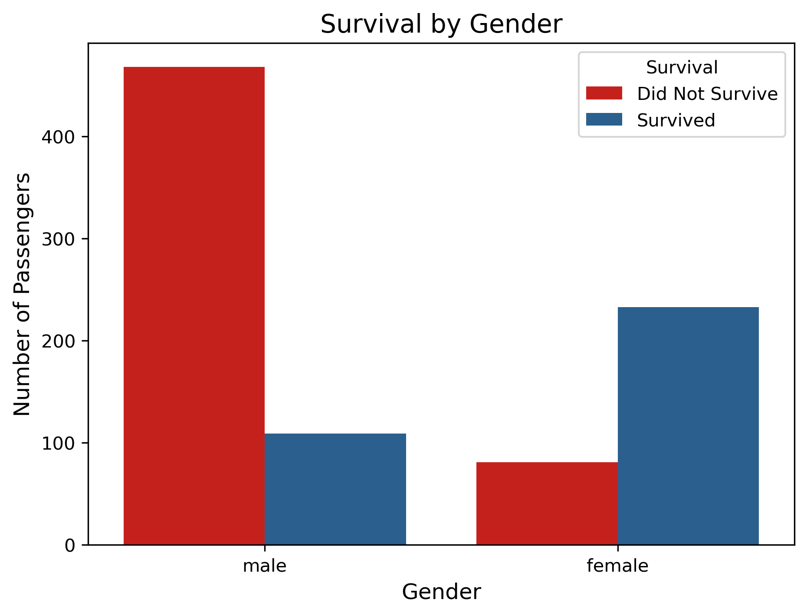

# Titanic Survival - Understanding Patterns and Predicting Outcomes

**Author:** Collins Nosa
**Date:** 2025-09-16

## Background

The Titanic dataset is one of the most well-known datasets in data science. It contains detailed information about passengers aboard the Titanic’s tragic voyage in 1912, including their age, gender, ticket class, fare, and survival status.

### This project aims to:

* Explore demographic and socio-economic factors that influenced survival.

* Compare survival rates across different passenger classes, genders, and age groups.

* Build a predictive model to estimate the likelihood of survival.

* Demonstrate a complete data analysis workflow from cleaning to visualization and modeling.

The goal is to turn raw passenger data into meaningful insights and predictive power that highlight the value of data-driven analysis.

# Step 1: Task Requirements

### Business Task

Identify the key factors that influenced passenger survival on the Titanic. The analysis will focus on demographic and socio-economic attributes such as age, gender, and ticket class, with the goal of uncovering survival patterns and building a predictive model to estimate survival outcomes.

### Problem Statement
The sinking of the Titanic in 1912 resulted in significant loss of life, but survival was not random. Passenger outcomes were influenced by factors such as age, gender, and socio-economic status. Without proper analysis, it is unclear which groups had higher chances of survival and why. By examining this dataset, the project will uncover the patterns behind survival and demonstrate how data analysis and predictive modeling can provide meaningful insights from historical events.

# Step 2: Data Acquisition and Preparation

### Data & Source Integrity

This analysis uses the Titanic dataset, which contains historical passenger information from the Titanic’s maiden voyage in 1912. The dataset includes details such as passenger demographics, ticket class, fares, and survival outcomes. The dataset is publicly available [here.](https://www.kaggle.com/competitions/titanic/data)

### Observations

The Titanic dataset contains detailed information about passengers aboard the ship, including demographics, travel class, and survival outcomes. Key columns used in this analysis include:

* **Survived:** Survival status (0 = No, 1 = Yes)

* **Pclass:** Ticket class (1 = First, 2 = Second, 3 = Third)

* **Sex:** Gender of the passenger

* **Age:** Passenger age in years

* **SibSp:** Number of siblings/spouses aboard

* **Parch:** Number of parents/children aboard

* **Fare:** Passenger fare

* **Embarked:** Port of embarkation (C = Cherbourg, Q = Queenstown, S = Southampton)

These columns were selected to explore survival patterns and build predictive models.

# Step 3: Processing Data (Cleaning and Transformation)

### Tools Used:  

* Python (Pandas): For loading, cleaning, and manipulating the dataset.

* Python (Matplotlib & Seaborn): For exploratory data analysis and creating visualizations to spot patterns.

* Python (Scikit-learn): For building and evaluating predictive models, such as Logistic Regression.

### Cleaning and Transforming the Data

The Titanic dataset `(train.csv)` was originally stored in a raw CSV format and contained missing values and categorical variables that needed encoding. It was imported into Python for cleaning and preprocessing, and the dataset contains `891` passenger records.

### Importing Necessary Libraries

```python
import pandas as pd
import numpy as np
import seaborn as sns
import matplotlib.pyplot as plt

from sklearn.model_selection import train_test_split
from sklearn.linear_model import LogisticRegression
from sklearn.preprocessing import StandardScaler
from sklearn.metrics import accuracy_score, confusion_matrix, classification_report
```
###  Loading the `.csv` dataset and a glimpse at the dataframe

```python
# Loading the .csv dataset
df = pd.read_csv("train.csv")

# Taking a glimpse at the dataset
df.head()

# Checking for missing values in each column
df.isnull().sum()

# Checking data types
df.info()
```


### Handling Missing Values

```python
# Fill missing Age values with median
df['Age'].fillna(df['Age'].median(), inplace=True)

# Fill missing Embarked values with the most frequent port
df['Embarked'].fillna(df['Embarked'].mode()[0], inplace=True)

# Drop Cabin column due to a high percentage of missing values, which could introduce bias.
df.drop('Cabin', axis=1, inplace=True)

# Drop Irrelevant Columns
df = df.drop(columns=['PassengerId', 'Name', 'Ticket'])

# Create a Copy for EDA Plots
df_plot = df.copy()
```
# Step 4: Exploratory Data Analysis (EDA)

### Survival Count

```python
plt.figure(figsize=(7,5))
sns.countplot(x='Survived', data=df_plot, palette='Set2')
plt.title("Number of Passengers: Survived vs Did Not Survive", fontsize=14)
plt.xlabel("Survival Status", fontsize=12)
plt.ylabel("Number of Passengers", fontsize=12)
plt.xticks([0,1], ['Did Not Survive', 'Survived'])
plt.show()
```


This bar chart compares the number of passengers who survived against those who did not. The chart shows that more passengers did not survive than those who survived, highlighting the overall lower survival rate during the Titanic disaster.

### Survival by Gender

```python
plt.figure(figsize=(7,5))
sns.countplot(x='Sex', hue='Survived', data=df_plot, palette='Set1')
plt.title("Survival by Gender", fontsize=14)
plt.xlabel("Gender", fontsize=12)
plt.ylabel("Number of Passengers", fontsize=12)
plt.legend(title='Survival', labels=['Did Not Survive', 'Survived'])
plt.show()
```


This bar chart shows survival outcomes by gender. Female passengers had a much higher survival rate, as seen by the taller `Survived` bar compared to males. In contrast, most male passengers did not survive, highlighting gender as a strong factor influencing survival on the Titanic.

### Survival by Passenger Class

```python
plt.figure(figsize=(7,5))
sns.countplot(x='Pclass', hue='Survived', data=df_plot, palette='Set3')
plt.title("Survival by Passenger Class", fontsize=14)
plt.xlabel("Passenger Class (1=1st, 2=2nd, 3=3rd)", fontsize=12)
plt.ylabel("Number of Passengers", fontsize=12)
plt.legend(title='Survival', labels=['Did Not Survive', 'Survived'])
plt.show()
```


This bar chart shows survival outcomes across passenger classes. Passengers in 1st class had the highest survival rate, while those in 3rd class had the lowest. The clear decline from 1st to 3rd class highlights how social and economic status strongly influenced survival chances on the Titanic.

### Age Distribution and Survival

```python
plt.figure(figsize=(8,5))
sns.histplot(
    data=df_plot, 
    x='Age', 
    hue='Survived', 
    palette={0: '#E10600', 1: '#1B609D'},
    bins=30, 
    kde=True,
    alpha=0.6
)
plt.title("Age Distribution by Survival", fontsize=14)
plt.xlabel("Age (Years)", fontsize=12)
plt.ylabel("Number of Passengers", fontsize=12)
plt.show()
```


This histogram shows the distribution of passenger ages on the Titanic, separated by survival. Most passengers were between 20 and 40 years old. The red bars represent passengers who did not survive, and the blue bars represent those who survived. The smooth curves highlight the age trends for each group, showing that younger and middle-aged adults made up the majority of passengers, with survival varying across age ranges.

# Summarizing Findings

After analyzing the Titanic dataset, several key patterns emerged from the visualizations:

1. **Survival Count:** Fewer passengers survived than those who did not, showing the tragic outcome of the voyage.

2. **Survival by Gender:** Female passengers had a noticeably higher survival rate than male passengers, highlighting gender as a strong factor in survival.

3. **Survival by Passenger Class:** First-class passengers were more likely to survive than second- or third-class passengers, indicating that ticket class influenced survival outcomes.

4. **Age Distribution and Survival:** Most passengers were young adults, and survival varied slightly across age groups. Children had a better chance of survival compared to older adults.


# Step 5: Modeling and Evaluation

To predict passenger survival, a Logistic Regression model was built using key features such as passenger class, gender, age, family size, fare, embarked port, and title.

### Convert Boolean dummy columns to int
```python
for col in df.columns:
    if df[col].dtype == 'bool':
        df[col] = df[col].astype(int)
```

### Encoding Categorical Variables

```python
# Encode Sex column (male=0, female=1) to facilitate model training.
df['Sex'] = df['Sex'].map({'male': 0, 'female': 1})

# one-hot encoding to convert the 'Embarked' column into separate binary columns for each port
df = pd.get_dummies(df, columns=['Embarked'], drop_first=True)
```
### Feature Engineering

**Family Size:** Created a new feature by combining 'SibSp' (siblings/spouses aboard) and 'Parch' (parents/children aboard) to represent the total family size aboard.

```python
# Create FamilySize feature from SibSp and Parch
df['FamilySize'] = df['SibSp'] + df['Parch']
```
**Title:** Extracted titles ( Mr, Master, Mrs, Miss) from passenger names to capture social status, which may influence survival.

```python
# Extract Title from Name
df['Title'] = df['Name'].str.extract(' ([A-Za-z]+)\.', expand=False)

# Map rare titles to 'Other'
df['Title'] = df['Title'].replace(['Lady', 'Countess', 'Capt', 'Col', 'Don', 'Dr', 'Major', 'Rev', 'Sir', 'Jonkheer', 'Dona'], 'Other')

# Convert common titles to numerical values
title_mapping = {'Mr': 0, 'Miss': 1, 'Mrs': 2, 'Master': 3, 'Other': 4}
df['Title'] = df['Title'].map(title_mapping)
```

### Feature Selection

```python
# Select features for modeling
features = ['Pclass', 'Sex', 'Age', 'FamilySize', 'Fare', 'Embarked_Q', 'Embarked_S', 'Title']
X = df[features]
y = df['Survived']
```

### Feature Scaling

Applied feature scaling ( StandardScaler) to numerical features like 'Age' and 'Fare' to normalize the data, ensuring all features contribute equally to the model.

```python
scaler = StandardScaler()
X[['Age', 'Fare']] = scaler.fit_transform(X[['Age', 'Fare']])

print(df[['Age','Fare']].head())
```

### Train-Test Split

Split the dataset into training (80%) and testing (20%) sets to evaluate model performance.

```python
from sklearn.model_selection import train_test_split

X_train, X_test, y_train, y_test = train_test_split(
    X, y, test_size=0.2, random_state=42
)
```

### Logistic Regression Model
Trained a Logistic Regression model to predict passenger survival. Logistic Regression is suitable here because the target variable (Survived) is binary.

```python
from sklearn.linear_model import LogisticRegression

model = LogisticRegression(max_iter=200)
model.fit(X_train, y_train)

y_pred = model.predict(X_test)
```

### Model Evaluation
Used accuracy score, confusion matrix, and a classification report (precision, recall, F1-score) to assess model performance.

```python
from sklearn.metrics import accuracy_score, confusion_matrix, classification_report

accuracy = accuracy_score(y_test, y_pred)
print("Model Accuracy:", accuracy)

print("\nConfusion Matrix:")
print(confusion_matrix(y_test, y_pred))

print("\nClassification Report:")
print(classification_report(y_test, y_pred))
```


**Accuracy:** The Logistic Regression model achieved an accuracy of 0.81, correctly predicting survival for 81% of passengers in the test set.

The Confusion Matrix and Classification Report are also displayed on the screenshot above

**Key Predictors:**

* Gender: Female passengers had a higher probability of survival.

* Passenger Class: First-class tickets increased survival chances.

* Other features (Age, FamilySize, Fare, Title, Embarked) contributed to the model, but gender and class were the strongest predictors.

Handling Class Imbalance: A balanced-class Logistic Regression model was also tested, confirming that the predictions were fair across both survival classes.

### Logistic Regression with balanced class weights
Since survival classes are not evenly distributed, a balanced-class Logistic Regression model was also tested, confirming that the predictions were fair across both survival classes.

```python
log_reg_balanced = LogisticRegression(class_weight='balanced', max_iter=1000)
log_reg_balanced.fit(X_train, y_train)

y_pred_balanced = log_reg_balanced.predict(X_test)
```


 # Conclusion

This analysis shows how we can use cleaned and prepared Titanic data to predict whether a passenger survived. By looking at features like age, gender, and passenger class, we can see which factors had the biggest impact on survival.

These findings help us understand the story behind the data and show how data can be used to answer real-world questions.